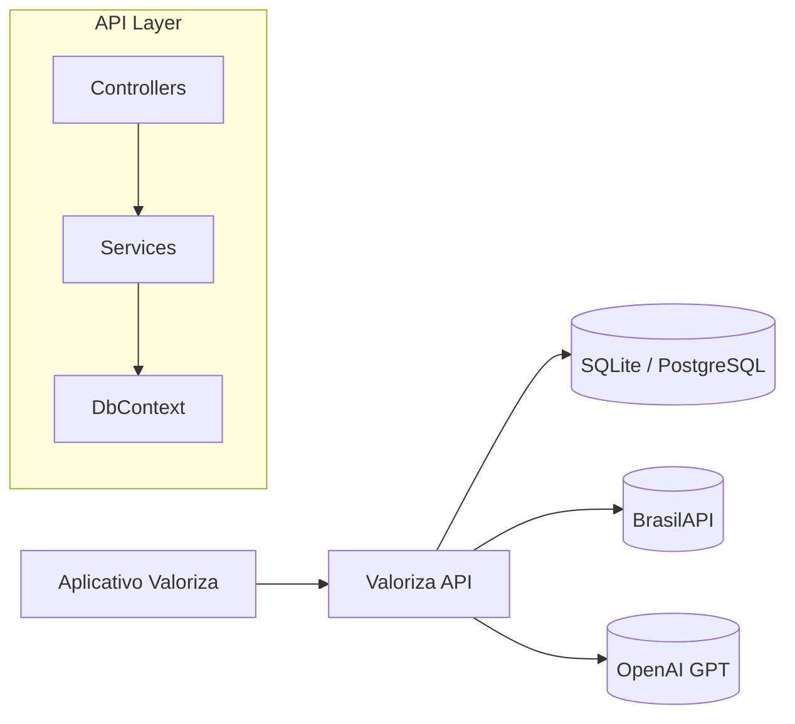
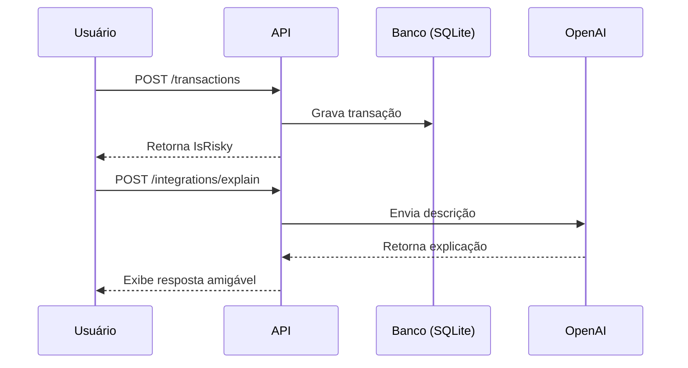

# Valoriza API — ASP.NET Core 8 + Entity Framework Core

Valoriza é uma API desenvolvida em ASP.NET Core Web API com Entity Framework Core e Swagger, baseada no projeto “Valoriza” — um assistente inteligente que une educação financeira e inteligência artificial para promover controle de hábitos financeiros e investimentos conscientes.

## Tecnologias Utilizadas

| Categoria      | Tecnologias                               |
| -------------- | ----------------------------------------- |
| Linguagem      | C# (.NET 8)                               |
| Framework      | ASP.NET Core Web API                      |
| ORM            | Entity Framework Core (SQLite)            |
| Documentação   | Swagger / Swashbuckle                     |
| Mapeamento     | AutoMapper                                |
| Integrações    | BrasilAPI (CEP), OpenAI (ChatGPT)         |
| Banco de dados | SQLite (dev) / PostgreSQL (prod opcional) |

## Arquitetura da Solução

```
Valoriza.sln
 ├── Valoriza.Api/              → Camada de apresentação (Controllers, Swagger)
 ├── Valoriza.Application/      → Regras de negócio, DTOs, Services
 ├── Valoriza.Domain/           → Entidades e modelos de domínio
 └── Valoriza.Infrastructure/   → DbContext, Migrations e conexões com o banco
```

### Diagrama de Arquitetura (Mermaid)



### Diagrama de Sequência



## Instalação e Execução Local

### 1. Pré-requisitos

* .NET SDK 8
* Visual Studio 2022 ou VS Code
* (Opcional) Chave da API OpenAI, se quiser testar /integrations/explain

### 2. Configurar o banco de dados

O projeto usa SQLite por padrão. O arquivo `appsettings.Development.json` já contém:

```json
{
  "Database": { "Provider": "sqlite" },
  "ConnectionStrings": { "Sqlite": "Data Source=valoriza.db" }
}
```

### 3. Gerar o banco (via Package Manager Console)

```powershell
Add-Migration InitialCreate -StartupProject Valoriza.Api -Project Valoriza.Infrastructure
Update-Database -StartupProject Valoriza.Api -Project Valoriza.Infrastructure
```

### 4. Rodar a API

```bash
dotnet run --project Valoriza.Api
```

Acesse no navegador:

```
https://localhost:7096/swagger
```

## Endpoints Principais

### TransactionsController (/api/transactions)

| Método | Endpoint                        | Descrição                               |
| ------ | ------------------------------- | --------------------------------------- |
| POST   | /api/transactions               | Cria uma nova transação                 |
| GET    | /api/transactions/{id}          | Busca por ID                            |
| GET    | /api/transactions/user/{userId} | Lista todas de um usuário               |
| PUT    | /api/transactions/{id}          | Atualiza uma transação                  |
| DELETE | /api/transactions/{id}          | Remove uma transação                    |
| GET    | /api/transactions/search        | Pesquisa com LINQ (filtros combináveis) |

#### Exemplo de corpo para POST:

```json
{
  "userId": "00000000-0000-0000-0000-000000000001",
  "amount": 600,
  "description": "Aposta esportiva",
  "category": "Gambling"
}
```

#### Pesquisa (LINQ):

`GET /api/transactions/search?userId=00000000-0000-0000-0000-000000000001&risky=true`

### IntegrationsController (/api/integrations)

| Método | Endpoint                    | Descrição                         |
| ------ | --------------------------- | --------------------------------- |
| GET    | /api/integrations/cep/{cep} | Consulta CEP via BrasilAPI        |
| POST   | /api/integrations/explain   | Explica um gasto com IA (ChatGPT) |

Exemplo de body (para /explain):

```json
"gasto alto em aposta esportiva"
```

## LINQ e Regras de Negócio

* Filtros combináveis (start, end, category, min, max, risky)
* Ordenação por valor (OrderByDescending)
* Limite de resultados (Take 10)
* Regra de risco automática:

  * `IsRisky = true` se `Category == Gambling` ou `Amount >= 500`

## Estrutura do Banco (SQLite)

Tabelas geradas automaticamente via EF Core:

* Users
* Transactions
* RiskSignals

## IA Explicável (XAI)

A API utiliza o endpoint `/integrations/explain` com o modelo OpenAI GPT-4o-mini para gerar explicações simples e educativas sobre gastos e comportamentos, simulando a função de um mentor financeiro.

## Principais Pacotes NuGet

| Projeto                 | Pacotes                                                                                                                                                                                     |
| ----------------------- | ------------------------------------------------------------------------------------------------------------------------------------------------------------------------------------------- |
| Valoriza.Api            | Swashbuckle.AspNetCore, Swashbuckle.AspNetCore.Annotations, AutoMapper.Extensions.Microsoft.DependencyInjection                                                                             |
| Valoriza.Application    | AutoMapper, Microsoft.Extensions.Http, Microsoft.Extensions.Configuration.Abstractions                                                                                                      |
| Valoriza.Infrastructure | Microsoft.EntityFrameworkCore, Microsoft.EntityFrameworkCore.Sqlite, Microsoft.EntityFrameworkCore.Design, Npgsql.EntityFrameworkCore.PostgreSQL, Microsoft.Extensions.Configuration.Binder |
| Valoriza.Domain         | Nenhum                                                                                                                                                                                      |


## Licença

— FIAP 2025. Licença MIT.
Projeto acadêmico desenvolvido por:
<br> Julio Cesar Zampieri <br>
Lucas Carlos Bandeira Texeira <br>
João Gabriel Dias do Nascimento <br>
Gustavo Mello <br>
Carlos Augusto Ganzerli <br>

